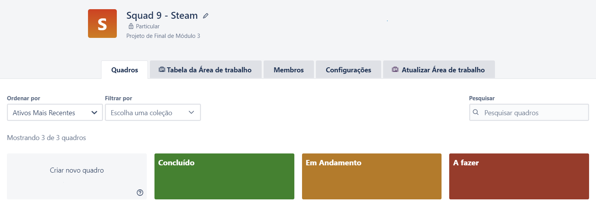
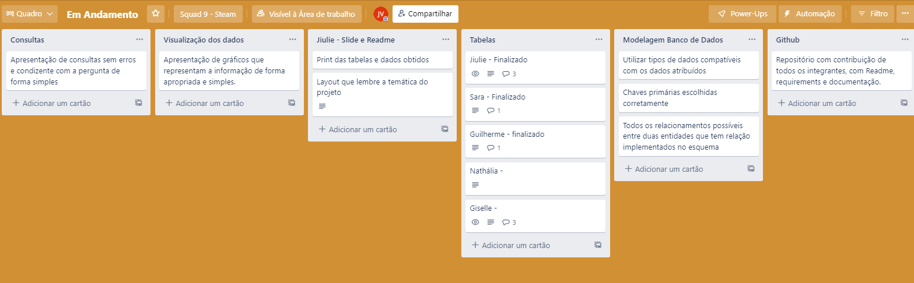
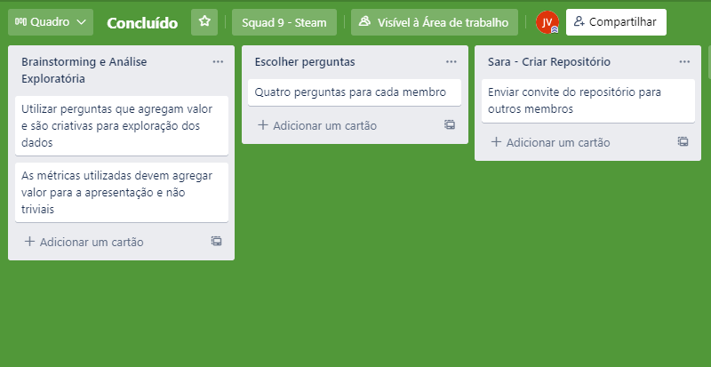
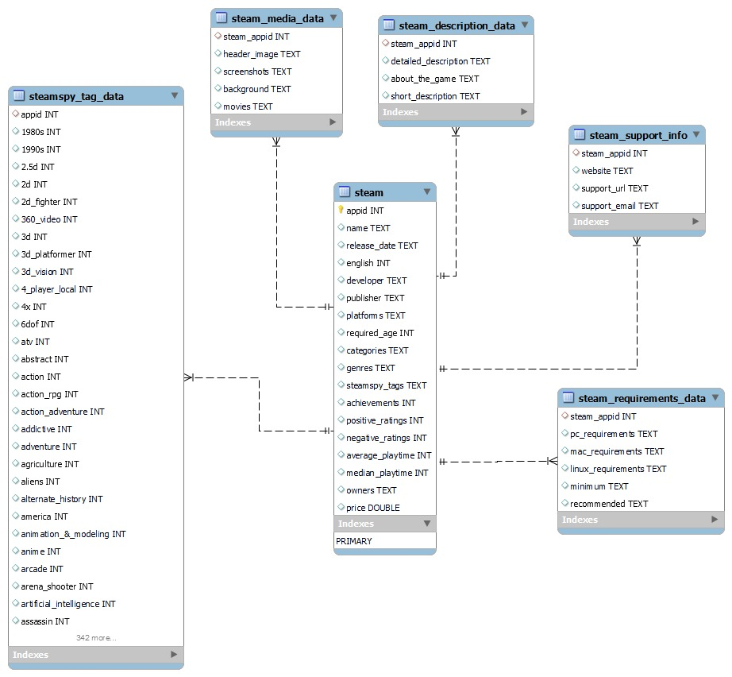

# Steam - Database

  <a href="#sobre">Sobre</a>&nbsp;&nbsp;
  <a href="#andamento">Andamento</a>&nbsp;&nbsp;
  <a href="#linguagens">Softwares & Ferramentas utilizadas</a>&nbsp;&nbsp;
  <a href="#grupo">Autores</a> &nbsp;&nbsp;
     <a href="#contribuir">Como contribuir</a>&nbsp;&nbsp;

<h2 id="sobre">Sobre 🔎</h2>
  
 A proposta do projeto era montar um dashboard do banco de dados escolhido pelo grupo. Dividido em duas etapas, os objetivos principais eram: 

  
 - Estruturar o esquema do banco de dados: A partir da avaliação do conjunto de dados fornecidos, modelar as tabelas do banco. Note que não é necessário mapear todas as colunas de todas as tabelas. Mantenha sua implementação simples construindo um modelo que atende às perguntas elaboradas pelo grupo
 - Realizar carga no banco: Com base no esquema desenhado e criado, subir os dados presentes nos arquivos para o banco de dados a fim de verificar o funcionamento da solução encontrada.
- Ideação/Brainstorm sobre perguntas que podem ser respondidas pelos dados: Analise o conjunto de dados selecionado para que as perguntas sejam pertinentes. Neste primeiro momento, dê asas a imaginação. As perguntas geradas nesta etapa impactam diretamente as demais desta Sprint.
- Criar visualizações dos dados com base nas perguntas elaboradas na sprint anterior (aqui vocês podem usar planilhas (Excel / Google), Metabase, Tableau, Power Bi, etc)
 - Montar uma apresentação a partir das perguntas e análise exploratória feita em cima do conjunto de dados selecionado

 

<h2 id="andamento">Andamento do projeto 📈</h2>

  

<h2 id="linguagens">Softwares & Ferramentas utilizadas nesse projeto 📚</h2>

  - [x] HTML5
  - [x] CSS3
  - [x] JavaScript
  - [x] MySQL
  - [x] Git
  - [x] KanBan
  - [x] Trello
  - [x] Canva

 

<h2 id="modelagem">Modelagem do Banco - MySQL</h2>

<h2 id="grupo">Squad 🎮 </h2>

 Esse projeto foi pensado e executado por: 

<table>
  <tr>
    <td align="center">
      <a href="https://www.linkedin.com/in/giselle-leadebal-869528128/">
   
  
  <b> Giselle Leadebal </b>
  
      </a>
    </td>
    <td align="center">
      <a href="https://www.linkedin.com/in/guilherme-cordeiro-da-mata/">
   
  
  <b> Guilherme da Mata </b>
  
      </a>
    </td>
    <td align="center">
      <a href="https://www.linkedin.com/in/jiulie-vitoria/">
         
        
          <b>Jiulie Vitória</b>
        
      </a>
    </td>
<td align="center">
<td align="center">
      <a href="https://www.linkedin.com/in/nuchoa/">
         
        
          <b>Nathália Uchôa</b>
        
      </a>
    </td>
<td align="center">
      <a href="https://www.linkedin.com/in/saralirio/">
         
        
          <b>Sara Lírio</b>
        
      </a>
    </td>
  </tr>
</table>

<h2 id="contribuir">Como contribuir 📫</h2>

Para contribuir com nosso projeto, siga estas etapas:
  >- Bifurque este repositório.
  >- Crie um branch: `git checkout -b <nome_branch>`.
  >- Faça suas alterações e confirme-as: `git commit -m '<mensagem_commit>'`
  >- Envie para o branch original: `git push origin <nome_do_projeto> / <local>`
  >- Crie a solicitação de pull.
*Consulte a documentação do GitHub em* [como criar uma solicitação pull](https://help.github.com/en/github/collaborating-with-issues-and-pull-requests/creating-a-pull-request).

  &#11165;&nbsp;<a href="#inicio"><strong>Voltar ao topo</strong></a>&nbsp;&#11165;

